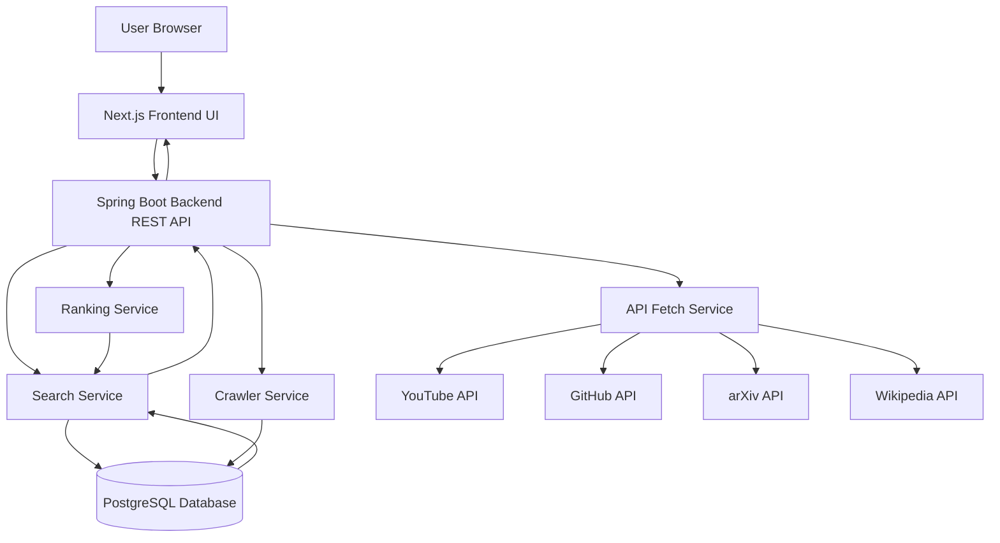

  

# DORA

DORA is an educational meta search engine inspired by Dora the Explorer.
It is designed to help students and researchers discover academic material from
multiple learning sources through one unified search experience.

## Selected Technology Stack

### Frontend

- Next.js
- Tailwind CSS

### Mobile

- Flutter

### Backend

- Spring Boot
- Spring Data JPA
- REST API

### Database

- PostgreSQL

### Crawling

- Jsoup

### External APIs

- YouTube API
- GitHub API
- arXiv API
- Wikipedia API

### Development Tools

- Maven
- Git
- Postman

## Project Structure

We are starting with a modular monorepo:

- `backend/` holds the Spring Boot application.
- `frontend/` holds the Next.js web client.
- `mobile/` holds the Flutter mobile application.
- `docs/` stores architecture and planning notes.
- `shared/` keeps cross-project contracts and shared schemas.
- `crawler/` is reserved for controlled educational web crawling jobs.
- `indexer/` is reserved for indexing and ranking experiments.

## Architecture Choice

The first version should be a modular monolith, not microservices.
That gives us:

- faster development with one backend deployment
- clear module boundaries for future extraction
- simpler local setup for a student project
- enough structure to support API search, crawling, and local indexing

## Proposed Search Flow

1. The user searches from the Next.js frontend.
2. The frontend sends the query to the Spring Boot REST API.
3. The backend combines results from PostgreSQL, external APIs, and selected crawled sources.
4. The ranking layer scores results using relevance, source priority, and recency.
5. The frontend renders grouped results such as papers, videos, tutorials, articles, and source code.

## System Architecture

See `docs/architecture.md` for the detailed system design.
